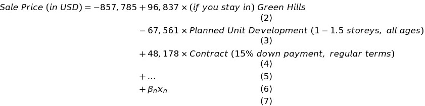
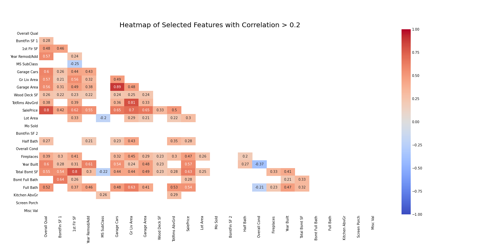
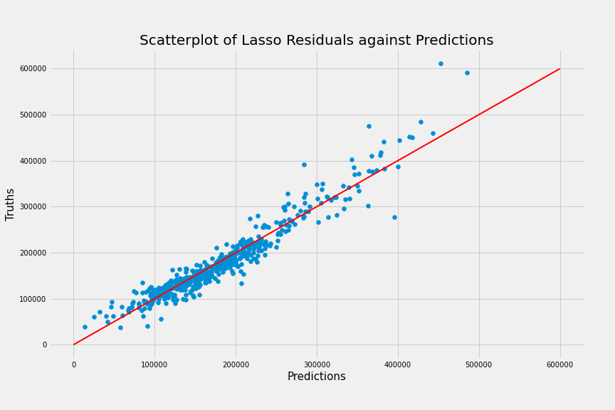
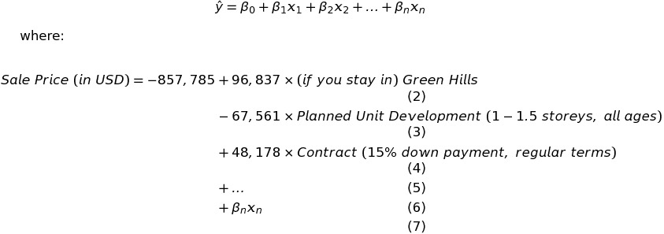
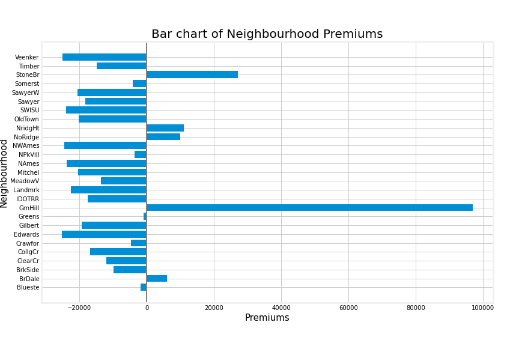

#  Project 2: Predicting House Prices - A Study of Housing in Ames, Iowa

### Overview

As a prospective home owner, I am provided with the housing dataset for the greater region of Ames, Iowa. If I were to move to Ames and in the market to buy a house, how can I best value the properties to ensure I get the most value for my money? Which neighbourhoods should I consider that is most worth it as someone new to the area and unaware of the dynamics? These are all questions sought and answered in this study for myself, and for all prospective home owners in the future.

---

### Executive Summary

Please use the following links to get around:

- [Executive Summary](#Executive-Summary)
- [Datasets](#Datasets)
- [Analysis and Evaluation](#Analysis-and-Evaluation)
- [Conclusions](#Conclusions)

This study is conducted across two notebooks. We have a **"Predicting House Prices - Data and Features.ipynb"** data notebook used for cleaning all datasets, exploratory data analysis, features selection and engineering, and preparation of DataFrames, and a separate **"Predicting House Prices - Model.ipynb"** notebook for modelling and predictions. Both notebooks are located in the same **codes** folder and should be read in conjunction with each other.

For the purposes of cleaning datasets, we employed different strategies of dealing with missing values. To deal with them evenly, the two dataframes (both training and test sets) were merged. Care was taken to ensure no rows from test sets were dropped. To handle missing values, Deductive Imputation is the preferred option where possible. Next, we will consider Inferential Imputation (via mean/mode/median or even regression) if appropriate, followed by ignoring missing values entirely. In the case of large holes in feature data, we employ Available-Case Analysis to keep as much of the data as we can and drop the problematic feature entirely. In the case where the number of missing values in feature data is small, we employ Complete-Case Analysis and drop the problematic rows instead, thereby preserving the type of features we have at our disposal.

Features selection and engineering were done on an ad hoc basis as the model developed and strove to become more complex and nuanced. Primary features selection was done with the aid of the Lasso algorithm. Certain features, especially ordinal features, were also engineered to allow the model to train itself more meaningfully on the data. Dummy variables were created for all surviving categorical features. Exploratory Data Analysis was done along the way as needed to better the understand the data we are modelling.

Building the best model follow the same strategies throughout. We ensure no data leakage between the unseen test set and the training set. The training set is assigned into X features matrix and y target vector. X features matrix is, itself, split into training and testing models for cross-validation evaluation to preliminary find the best model/algorithm to use. Once the best model is found, we will fit our model onto our training data to evaluate its performance as well as generate predictions. From our evaluation of the final model, we can then return to the datasets (and other notebook) and relook at features of interest. The whole process repeats itself again and iterates for as many times as is necessary to build a staisfactory predictive model.

---

### Datasets

[Back to Top!](#Executive-Summary)

#### Provided Data

This project draws on the following datasets provided by the kaggle challenge:

- [Training Data](./datasets/train.csv)
- [Testing Data](./datasets/test.csv)
- [Sample of Predictions Format for Submission](./datasets/sample_sub_reg.csv)

You may find the kaggle challenge [here](https://www.kaggle.com/c/dsi-us-6-project-2-regression-challenge/overview).These datasets provide us with a wide range of data from physical housing features to contextual information on the property's history to method of sales.

There are more datasets in the folder that have been created after data cleaning and features selection/engineering. These form the base for the different models in the model notebook.

#### Data Dictionary

Below is the Data Dictionary for the original DataFrame. It does not include engineered features or dummy variables.

|Feature|Type|Dataset|Description|
|---|---|---|---|
|**state**|*string*|common|Dataset covers 50 States and 1 Federal District (District of Columbia) in USA.|
|-|-|-|-|
|**sat_2017_participation**|*integer*|SAT 2017|Participation rate of SAT assessment in percentage points (%) by State for the year 2017.|
|**sat_2017_erw**|*integer*|SAT 2017|Average score of the Evidence-Based Reading and Writing (ERW) section in the SAT assessment by State for the year 2017. A possible score ranges from 200-800.|
|**sat_2017_math**|*integer*|SAT 2017|Average score of the Math section in the SAT assessment by State for the year 2017. A possible score ranges from 200-800.|
|**sat_2017_total**|*integer*|SAT 2017|Average total score of the SAT assessment by State for the year 2017. Total score is calculated with the sum of both ERW and Math sections of the SAT. A possible score ranges from 400-1600.|
|-|-|-|-|
|**act_2017_participation**|*integer*|ACT 2017|Participation rate of ACT assessment in percentage points (%) by State for the year 2017.|
|**act_2017_eng**|*float*|ACT 2017|Average score of the English section in the ACT assessment by State for the year 2017. A possible score ranges from 1-36.|
|**act_2017_math**|*float*|ACT 2017|Average score of the Math section in the ACT assessment by State for the year 2017. A possible score ranges from 1-36.|
|**act_2017_read**|*float*|ACT 2017|Average score of the Reading section in the ACT assessment by State for the year 2017. A possible score ranges from 1-36.|
|**act_2017_sci**|*float*|ACT 2017|Average score of the Science section in the ACT assessment by State for the year 2017. A possible score ranges from 1-36.|
|**act_2017_comp**|*float*|ACT 2017|Average composite score of the ACT assessment by State for the year 2017. Total score is calculated with the mean of all sections (English, Math, Reading, Science) of the ACT. A possible score ranges from 1-36.|

---

### Analysis and Evaluation

[Back to Top!](#Executive-Summary)

#### Features Selection and Engineering

An important preliminary first step to selecting features from the dizzying wide array of data provided is to make use of the lasso algorithm to zone in on crucial features. The first pass over with lasso dummied every feature that can be included, through which we were able to distill out the surviving features that are deemed important by lasso. From there, we filtered for these surviving features and plotted the heatmap below.

It is also important to gauge for yourself the virtue of each of these features selected by lasso. After a manual curation of the now shortened list, and with the aid of the heatmap, features were further dropped and/or engineered. For example, where important features are ordinal or may be hypothesised to have an ordinal relationship, the decision was made to map ordinal integer values accordingly than to dummy them out as is standard protocol.

#### Final Model

|Model|Algorithm|No. of Features|R2 Score|MAE|RSS|MSE|RMSE|
|---|---|---|---|---|---|---|---|
|01|ridge|254|0.887|16919.277|256464204312.525|642767429.355|25352.858|
|02|lasso|254|0.855|17561.77|329880933175.126|826769256.078|28753.596|
|03|lasso|77|0.849|18073.36|344676365867.525|863850541.021|29391.334|
|04|ridge|77|0.878|17429.989|278069739174.266|696916639.535|26399.179|
|05|lasso|215|0.920|15667.263|269755028529.607|526865290.097|22953.546|
|06|linear regression|215|0.920|15914.373|270043784716.096|527429267.024|22965.828|

Through the iterative process of improving our model either via its features or with the choice of algorithm, 6 models were created and evaluated. Of these, 5 sets of predictions were made to Kaggle. Models 05 and 06 are the final model with very similar performance. As we can see, the final model has improved about 3-4% from the first baseline model.

Shown above is the scatterplot of Lasso model 05. Once we are satisfied with our model's performance and features matrix, model 06 was created with simple Linear Regression to allow model to fit on training set without scaling its features. This allows us to make meaningful use of its beta-coefficients and come to a better understanding of how eac feature in the features matrix contribute to the sale price of a property.

---

### Conclusions

[Back to Top!](#Executive-Summary)

#### Top 3 Features

By analysing the coefficients of our final Linear Regression model, we are able to determine the top 3 features that would have the greatest effect on the Sale Price of a property. Using the beta-coefficients, we can work out the equation of the Multiple Linear Regression model for:

From the lasso model, we can derive the intercept and base penalty for properties in the greater Ames region at USD -857,785 applied by our Linear Regression Model. There are a myriad of features and beta-coefficients thereafter that will determine the final price of the property. Of note are the 3 strongest predictors in our Linear Regression model that have the largest impact on sale prices. These predictors are also all dummy variables belonging to a larger, originally, categorical feature.

#### Neighbourhood Premiums

There are many features that play a part in predicting the sale price of a property. In this section, we would like to highlight the "Neighborhood" feature which we believe its findings will prove useful to prospective home owners.

Neighbourhoods is one of those features that is recorded as nominal variables in the data documentation, but which we believe can be more meaningfulyl interpreted as ordinal, especially when looking through the target scope of property sale price. It is conceivable that sale prices between neighbourhoods will differ based on the desirability of its location as well as any perception of prestige or exclusivity.

Leaving Green Hills premium as an outlier aside, top of the list is Stone Brook where you would need to pay a premium of USD 27,059 for a property in the neighbourhood. This is followed by Northridge Heights with a premium of USD 10,944. As the premiums of the these neighbourhoods are high, we can infer that they must be the more exclusive neighbourhood in the region. On the other end of the spectrum, we have Edwards with the deepest discount of USD 25,206 for a property there. This discount is trailed closely by Veenker with a discount of USD 25,076. By charting the coefficients above and clearly ascribing the premiums/discounts associated with each neighbourhood, it is hoped that prospective home owners can balance their search for their new homes with greater finesse by weighing neighbourhoods for its value dollar worth rather than chase overvalued exclusivity.

 
 
 
Thank you for reading this far. You are awesome!